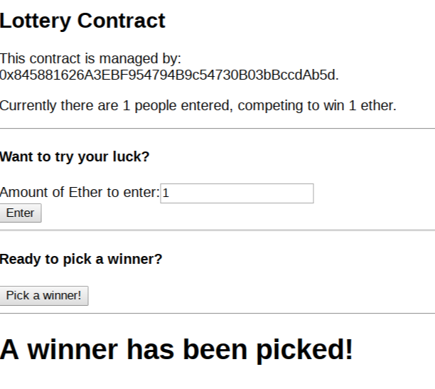

# ethereum-lottery-react

MVP ReactJS frontend for simple Lottery DAPP on the Ethereum Rinkeby test network.

## Install 

- `npm install`
- `npm start`

## Usage

Use Metamask with at least one account that has some Ethereum balance.

Minimum about per entry is > 0.01 ETH.

You can load up some ETH for test network, free, at [faucet.rinkeby.io](https://faucet.rinkeby.io/)

*Note*: Any ETH account can enter, but the same ETH account must be used to deploy the contract (manager) to pickWinner().

Contract deployment is over at [https://github.com/rudijs/ethereum-lottery](https://github.com/rudijs/ethereum-lottery)